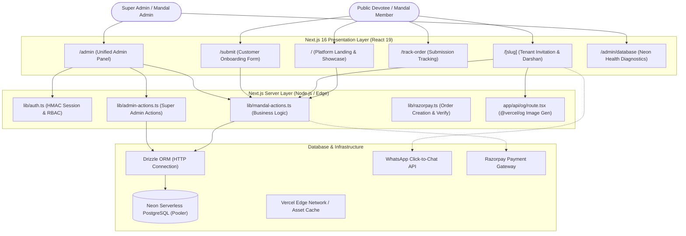
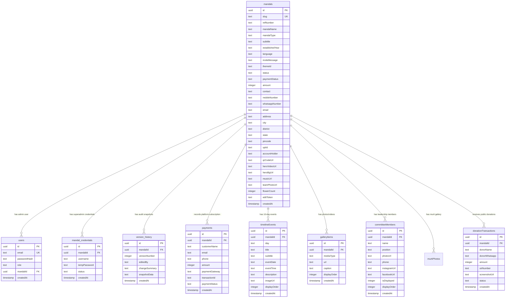
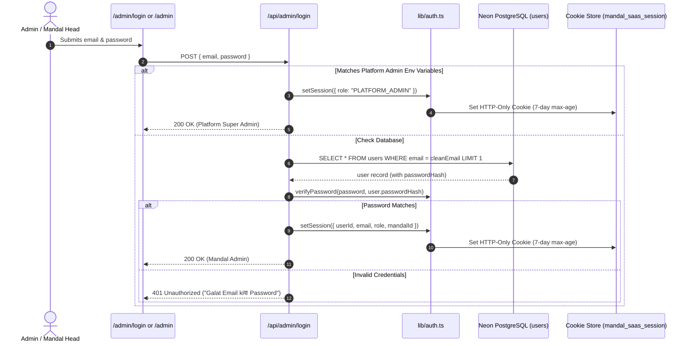
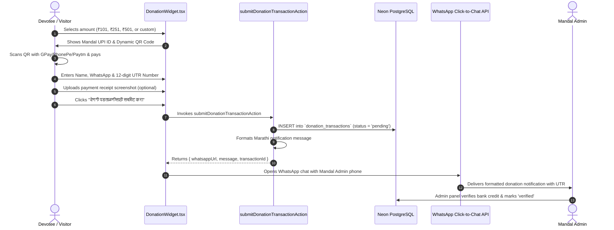

# SplitLedger AI / Ganapati Mandal SaaS Platform — Technical Architecture

This document provides a comprehensive technical deep-dive into the architectural design, database modeling, execution pipelines, security paradigms, theme engine, and component relationships of the **Adviks Softtech Ganapati Mandal Digital Invitation & Donation SaaS Platform** (codenamed `ganapati-mandal` / workspace `ganapati-invitation-platform`).

---

## 1. High-Level Architectural Overview

The application is structured as a modern **Multi-Tenant Serverless SaaS** deployed on Next.js 16 (App Router), leveraging Neon HTTP Serverless PostgreSQL via Drizzle ORM, Tailwind CSS 4, Framer Motion, and GSAP.



---

## 2. Directory Tree & File Inventory

```text
ganapati-invitation-platform/
├── app/
│   ├── [slug]/
│   │   └── page.tsx                     # Dynamic tenant mandal public invitation site
│   ├── admin/
│   │   ├── database/
│   │   │   └── page.tsx                 # Neon database live diagnostics & stats page
│   │   ├── login/
│   │   │   └── page.tsx                 # Dedicated SaaS login portal with one-touch demo credentials
│   │   ├── preview/
│   │   │   └── [mandalId]/
│   │   │       └── page.tsx             # Super admin private preview for unapproved mandals
│   │   └── page.tsx                     # Unified Admin Dashboard (Super Admin & Mandal Admin)
│   ├── api/
│   │   ├── admin/
│   │   │   ├── check-slug/
│   │   │   │   └── route.ts             # Real-time slug collision checker API
│   │   │   └── login/
│   │   │       └── route.ts             # Admin authentication endpoint (Super Admin & Mandal Admin)
│   │   ├── mandal/
│   │   │   └── update/
│   │   │       └── route.ts             # Token-based external mandal content update API
│   │   ├── og/
│   │   │   └── route.tsx                # Dynamic social share card generation (@vercel/og)
│   │   └── razorpay/
│   │       ├── create-order/
│   │       │   └── route.ts             # Razorpay order initialization API
│   │       ├── verify/
│   │       │   └── route.ts             # Razorpay HMAC SHA256 payment signature verification
│   │       └── webhook/
│   │           └── route.ts             # Razorpay payment status webhook handler
│   ├── demo/
│   │   └── page.tsx                     # Showcase gallery comparing all 4 spiritual themes
│   ├── edit/
│   │   └── [token]/
│   │       └── page.tsx                 # Token-based secure edit page (no password required)
│   ├── login/
│   │   └── page.tsx                     # Redirect route -> /admin/login
│   ├── mandal/
│   │   └── login/
│   │       └── page.tsx                 # Redirect route -> /admin/login
│   ├── submit/
│   │   ├── thank-you/
│   │   │   └── page.tsx                 # Post-submission confirmation with reference number
│   │   └── page.tsx                     # Multi-step customer onboarding registration form
│   ├── track-order/
│   │   └── page.tsx                     # Live customer submission & approval status lookup
│   ├── favicon.ico                      # Application favicon
│   ├── globals.css                      # Global Tailwind 4 styles, font variables & keyframes
│   ├── layout.tsx                       # Root layout (Rozha One, Mukta fonts, Vercel Analytics)
│   └── page.tsx                         # High-converting landing page with audio, video & showcase
├── components/
│   ├── admin/
│   │   ├── AdminDashboardClient.tsx     # Client-side tabbed admin dashboard controller
│   │   ├── AdminSidebar.tsx             # Responsive role-aware admin sidebar navigation
│   │   ├── AdminThemeToggle.tsx         # Dark/Gold admin panel appearance switcher
│   │   ├── CreateMandalModal.tsx        # Super Admin direct tenant creation modal
│   │   ├── CredentialsPanel.tsx         # Super Admin credential management & password reset panel
│   │   ├── DeleteButton.tsx             # Permanent deletion button with confirmation modal
│   │   ├── DonationsPanel.tsx           # Public donation audit, CSV exporter & verification panel
│   │   ├── MandalContentEditor.tsx      # Comprehensive tabbed WYSIWYG editor for all mandal data
│   │   ├── UnapproveButton.tsx          # Status rollback button (Approved -> Pending)
│   │   └── VersionHistoryPanel.tsx      # Audit trail & point-in-time snapshot rollback panel
│   ├── animations/
│   │   └── ScrollReveal.tsx             # Framer Motion stagger reveal component (unimported helper)
│   ├── coconut/
│   │   └── CoconutBreak.tsx             # Interactive digital coconut breaking shubh-arambh ritual
│   ├── common/
│   │   ├── BackgroundVideo.tsx          # Responsive background video stream with fallback poster
│   │   ├── CornerDecoration.tsx         # Traditional Indian rangoli & border corner ornament
│   │   ├── DesignSystem.tsx             # Reusable design system library (cards, buttons, headers)
│   │   ├── SectionDivider.tsx           # Festive golden floral divider between page sections
│   │   └── ThemeDecorations.tsx         # Theme-specific decoration sets (Royal, Peshwai, Saffron, Night)
│   ├── themes/
│   │   ├── Theme1RoyalGold.tsx          # Theme 1: Brass columns, temple gates, deep maroon & gold
│   │   ├── Theme2Peshwai.tsx            # Theme 2: Wada architecture, crimson borders, tutari motifs
│   │   ├── Theme3DivineSaffron.tsx      # Theme 3: Glassmorphism, saffron glow, modern UI cards
│   │   ├── Theme4NightDarshan.tsx       # Theme 4: Deep midnight blue, glowing oil diyas & illumination
│   │   └── ThemeRenderer.tsx            # Theme switcher dispatcher based on `mandal.themeId`
│   ├── Blessings.tsx                    # Traditional Ganapati shloka & blessings display section
│   ├── CommitteeSection.tsx             # Executive committee members card grid
│   ├── CopyButton.tsx                   # One-click clipboard copy component with visual feedback
│   ├── DonationWidget.tsx               # Public visitor donation UI (QR, UPI, UTR, WhatsApp proof)
│   ├── DoorsOverlay.tsx                 # Opening temple doors intro animation
│   ├── EditForm.tsx                     # Form component for token-based quick edits
│   ├── FestiveAudioAndBlessing.tsx      # Audio player with bhajan, bell chime & flower shower counter
│   ├── Footer.tsx                       # Public mandal footer with Adviks Softtech credits
│   ├── Gallery.tsx                      # Filterable responsive photo & video media gallery
│   ├── GoogleMapSection.tsx             # Embedded Google Map with location directions CTA
│   ├── Hero.tsx                         # 100vh hero banner with floating murti, aura & bells
│   ├── HeroVideoSection.tsx             # Featured documentary / aarti video player section
│   ├── InvitationCard.tsx               # Traditional Marathi formal invitation card
│   ├── InvitationPreview.tsx            # Real-time preview component matching live layout
│   ├── Location.tsx                     # Standalone address card component
│   ├── MurtiCarousel.tsx                # Murti photos carousel with zoom & captions
│   ├── PaymentButton.tsx                # Razorpay checkout trigger button (stand-alone helper)
│   ├── PdfInvitationButton.tsx          # Standalone PDF invitation download trigger
│   ├── PdfInvitationCard.tsx            # Printable invitation card with download action
│   ├── PersonalizedInviteWidget.tsx     # Custom guest name generator for WhatsApp invites
│   ├── PreviewModal.tsx                 # Modal wrapper displaying `InvitationPreview`
│   ├── QRCodeWidget.tsx                 # Dynamic QR code generator for sharing website URL
│   ├── SubmitForm.tsx                   # 7-step customer onboarding registration form
│   ├── TeamGroupPhotoSection.tsx        # High-res president, committee & volunteer group photos
│   ├── Timeline.tsx                     # Interactive 10-day festival event schedule & aarti timings
│   ├── TrackedCTA.tsx                   # Analytics-tracked call-to-action button
│   └── WhatsAppInviteWidget.tsx         # Devotee-to-devotee WhatsApp sharing invitation creator
├── db/
│   ├── index.ts                         # Neon HTTP Serverless connection & Drizzle instance
│   ├── schema.ts                        # Drizzle PostgreSQL schema definitions (10 tables)
│   └── seed.ts                          # Comprehensive seed script with 4 demo mandals & credentials
├── lib/
│   ├── admin-actions.ts                 # Super Admin server actions (approve, reject, delete)
│   ├── admin-auth.ts                    # Password-based admin session helpers (legacy single-pass)
│   ├── auth.ts                          # Session token encoding, hashing, getSession & RBAC guards
│   ├── mandal-actions.ts                # Core CRUD server actions (tenants, timeline, gallery, donations)
│   ├── photo-upload.ts                  # Client-side image compression (`browser-image-compression`)
│   ├── razorpay.ts                      # Lazy singleton Razorpay client initialization
│   ├── slug.ts                          # Marathi-aware slug generator & domain URL resolver
│   ├── supabase-admin.ts                # Deprecated legacy database stub (migrated to Neon)
│   └── supabase-client.ts               # Deprecated legacy client stub (migrated to Neon)
├── public/
│   ├── audio/                           # Devotional audio files (bhajan.mp3, temple-bell.mp3)
│   ├── branding/                        # Adviks Softtech brand logos (SVG & PNG)
│   ├── images/
│   │   ├── backgrounds/                 # Mobile & desktop festive hero & section backdrops
│   │   ├── bells/                       # High-res temple bell PNGs with swing animations
│   │   ├── decorations/                 # Mandalas, flower garlands, coconut, diya, om, toran
│   │   ├── diyas/                       # Animated oil lamp flame graphics
│   │   ├── doors/                       # Left & right temple door textures for open animations
│   │   ├── family/                      # Committee member headshots (person-1, person-2, person-3)
│   │   ├── gallery/                     # Festival gallery showcase photographs
│   │   └── ganesh/                      # Transparent high-res Ganapati murti assets
│   └── video/                           # Festival background video streams (MP4)
├── supabase/
│   └── schema.sql                       # Legacy SQL file before migration to Neon Drizzle
├── .env.local                           # Environment variables (Neon DB, Admin Credentials, URLs)
├── drizzle.config.ts                    # Drizzle Kit CLI configuration
├── eslint.config.mjs                    # ESLint 9 configuration
├── neon.ts                              # Neon branching & preview environment configuration
├── next.config.ts                       # Next.js 16 configuration (serverActions body limit, remote images)
├── package.json                         # Dependencies, scripts & package metadata
├── postcss.config.mjs                   # PostCSS 8 configuration for Tailwind 4
└── tsconfig.json                        # Strict TypeScript compiler options & `@/*` path aliases
```

---

## 3. Database Architecture & Schema Specifications

The platform uses **Neon Serverless PostgreSQL** driven by **Drizzle ORM** (`drizzle-orm/neon-http`). All foreign keys enforce `onDelete: "cascade"` to maintain database referential integrity when tenants are deleted.

### Entity Relationship Diagram (ERD)



### Table Specifications

| Table | Purpose | Primary Key | Key Indexes | Foreign Keys | Status Enums / Notes |
| :--- | :--- | :--- | :--- | :--- | :--- |
| `mandals` | Core tenant table holding mandal metadata, theme, media & banking | `id` (UUID) | `slug_idx`, `status_idx`, `ref_number_idx` | None | `status`: `pending`, `approved`, `rejected`, `need_changes`, `published`, `suspended` |
| `users` | Auth accounts for Super Admin & Mandal Admins | `id` (UUID) | `email_idx`, `mandal_id_idx` | `mandalId` -> `mandals.id` | `role`: `PLATFORM_ADMIN`, `MANDAL_ADMIN` |
| `mandal_credentials` | Auto-generated credentials panel for Super Admin distribution | `id` (UUID) | `mandal_idx`, `username_idx` | `mandalId` -> `mandals.id` | `status`: `active`, `deactivated` |
| `version_history` | Audit log containing full JSON snapshot data for instant rollback | `id` (UUID) | `mandal_idx` | `mandalId` -> `mandals.id` | Snapshot includes mandal, events, gallery & committee |
| `payments` | Customer onboarding platform fee transaction records | `id` (UUID) | `mandal_idx`, `status_idx` | `mandalId` -> `mandals.id` | `paymentStatus`: `pending`, `verified`, `failed` |
| `timeline_events` | 10-day festival program, daily aarti & visarjan schedule | `id` (UUID) | `mandal_idx` | `mandalId` -> `mandals.id` | Reorderable via `displayOrder` |
| `gallery_items` | Photos & videos displayed in interactive lightbox | `id` (UUID) | `mandal_idx` | `mandalId` -> `mandals.id` | `mediaType`: `image`, `video` |
| `committee_members` | Executive committee, trustees & volunteer directory | `id` (UUID) | `mandal_idx` | `mandalId` -> `mandals.id` | `isDisplayed`: 1 (visible) / 0 (hidden) |
| `murti_photos` | Murti darshan carousel gallery | `id` (UUID) | `mandal_idx` | `mandalId` -> `mandals.id` | Ordered by `displayOrder` |
| `donation_transactions`| Devotee online donations via QR/UPI with UTR proof | `id` (UUID) | `mandal_idx`, `status_idx` | `mandalId` -> `mandals.id` | `status`: `pending`, `verified`, `rejected` |

---

## 4. Authentication & Role-Based Access Control (RBAC)

Authentication is handled natively in `lib/auth.ts` using signed, Base64-encoded, HTTP-only session cookies (`mandal_saas_session`). Passwords are encrypted with `bcryptjs` (salt rounds: 10).



### RBAC Permission Matrix

| Feature / Action | Anonymous Visitor | Mandal Admin | Platform Super Admin |
| :--- | :---: | :---: | :---: |
| View Live Approved Mandal (`/[slug]`) | ✅ | ✅ | ✅ |
| Submit Donation with UTR | ✅ | ✅ | ✅ |
| Track Order Status (`/track-order`) | ✅ | ✅ | ✅ |
| Submit New Mandal Request (`/submit`) | ✅ | ✅ | ✅ |
| View Unapproved Preview (`/admin/preview/[id]`) | ❌ | ❌ | ✅ |
| Edit Own Mandal Content (`/admin`) | ❌ | ✅ (Only own `mandalId`) | ✅ (All Mandals) |
| Manage Timeline, Gallery & Committee | ❌ | ✅ (Only own `mandalId`) | ✅ (All Mandals) |
| Approve / Reject / Suspend Mandals | ❌ | ❌ | ✅ |
| Assign Custom Slugs | ❌ | ❌ | ✅ |
| View Generated Password Credentials | ❌ | ❌ | ✅ |
| Reset Mandal Passwords & Toggle Status | ❌ | ❌ | ✅ |
| Rollback Version History | ❌ | ❌ | ✅ |
| Export Donations to CSV | ❌ | ✅ (Own Mandal) | ✅ (All Mandals) |
| Inspect Database Health (`/admin/database`) | ❌ | ❌ | ✅ |

---

## 5. End-to-End Business Workflows

### 5.1 Public Visitor Mandal Submission & Super Admin Approval

```mermaid
flowchart TD
    A[Visitor opens /submit] --> B[Fills Mandal Info, Contact, Address, UPI ID]
    B --> C[Adds Timeline, Uploads Photos with browser-image-compression]
    C --> D[Submits Form]
    D --> E[Server Action: submitCustomerRequestAction]
    E --> F[Generate Unique REF Number e.g. REF-20260907-XXXX]
    F --> G[Assign temporary slug: pending-ref-xxxx]
    G --> H[Insert mandal with status = 'pending']
    H --> I[Insert timeline events, gallery items & committee]
    I --> J[Save Initial Version History Snapshot]
    J --> K[Redirect to /submit/thank-you?ref=REF-XXXX]

    K -.-> L[Super Admin opens /admin -> Submissions Tab]
    L --> M{Review Details & Preview}
    M -->|Reject| N[Enter reason -> status = 'rejected']
    M -->|Request Changes| O[Enter note -> status = 'need_changes']
    M -->|Approve| P[Enter custom slug or auto-slugify Marathi name]
    P --> Q[API /api/admin/check-slug verifies availability]
    Q --> R[Server Action: approveMandalAction]
    R --> S[Set status = 'approved', update slug]
    S --> T[Generate random 10-char password]
    T --> U[Create user in `users` table with role = 'MANDAL_ADMIN']
    U --> V[Save in `mandal_credentials` table]
    V --> W[Save Version History Snapshot]
    W --> X[Revalidate Paths /admin & /[slug]]
    X --> Y[Website Live at /[slug]!]
```

### 5.2 Public Visitor Donation & Verification Flow



---

## 6. Theme Architecture & Dynamic Design System

The platform features **4 distinct spiritual themes**, switchable dynamically per mandal without data loss. Every theme consumes the identical `FullMandalData` payload through `components/themes/ThemeRenderer.tsx`.

```text
ThemeRenderer({ mandal })
   ├── case "royal_gold"     ──> <Theme1RoyalGold mandal={mandal} />
   ├── case "peshwai"        ──> <Theme2Peshwai mandal={mandal} />
   ├── case "divine_saffron" ──> <Theme3DivineSaffron mandal={mandal} />
   └── case "night_darshan"  ──> <Theme4NightDarshan mandal={mandal} />
```

### Theme Style Matrix

| Attribute | Theme 1: Royal Gold | Theme 2: Peshwai Heritage | Theme 3: Divine Saffron | Theme 4: Night Darshan |
| :--- | :--- | :--- | :--- | :--- |
| **Theme Identifier** | `royal_gold` | `peshwai` | `divine_saffron` | `night_darshan` |
| **Aesthetic Concept** | Suvarna Mandir, brass columns, royal palace darshan | Peshwa Wada, deep crimson, historic royal Maratha | Bright Bhagwa saffron, clean glassmorphism cards | Midnight temple illumination, glowing oil deepams |
| **Primary Color** | Gold (`#e8a93b`) | Saffron-Orange (`#d96a2b`) | Vivid Saffron (`#ea580c`) | Sky-Gold (`#38bdf8`) |
| **Background Tone** | Deep Maroon (`#1c0609`) | Royal Burgundy (`#2c0507`) | Dark Terracotta (`#180a03`)| Midnight Blue (`#050b14`) |
| **Decorations** | Temple bells, brass lamps, flower toran | Maratha wada wood trims, tutari motifs | Divine glowing auras, plumeria flowers | Floating diya flames, night star particles |
| **Card Styling** | Golden filigree borders | Warm wooden red-lacquered cards | Frosted glass (`backdrop-blur-md`) | Midnight translucent cards with neon accents |

---

## 7. Version History & Point-in-Time Audit Engine

To protect against accidental data deletion or unauthorized edits by Mandal Admins, every modification triggers `saveVersionHistory()`:

1. **Snapshot Creation**: The complete tenant tree (`mandals`, `timelineEvents`, `galleryItems`, `committeeMembers`) is serialized into a single JSON string.
2. **Version Incrementation**: Auto-calculates `versionNumber = count(*) + 1` for the tenant.
3. **Audit Trail**: Logs `editedBy` (`SUPER_ADMIN`, `MANDAL_ADMIN`, or `SUBMISSION_FORM`) along with `changeSummary`.
4. **Instant Rollback**: `restoreVersionAction(historyId)` parses the snapshot and overwrites the active tables within an atomic transaction.

---

## 8. API Route Handlers

| Route | Method | Access Level | Description |
| :--- | :--- | :--- | :--- |
| `/api/admin/check-slug` | `GET` | Public / Admin | Validates whether a slug is available or already claimed by another mandal. |
| `/api/admin/login` | `POST` | Public | Authenticates Super Admin or Mandal Admin, sets HTTP-only cookie. |
| `/api/mandal/update` | `POST` | Token-Auth | Updates mandal content using a secure `editToken`. |
| `/api/og` | `GET` | Public | Generates dynamic 1200x630px Open Graph preview cards for WhatsApp and social links. |
| `/api/razorpay/create-order` | `POST` | Public | Creates a Razorpay order in INR paise for platform setup fee. |
| `/api/razorpay/verify` | `POST` | Public | Verifies HMAC SHA-256 signature using `RAZORPAY_KEY_SECRET`. |
| `/api/razorpay/webhook` | `POST` | Webhook | Listens to Razorpay payment captured events with HMAC header check. |

---

## 9. Performance & Optimization Architecture

- **Server-Side Rendering (SSR) & Dynamic Caching**: Tenant pages (`/[slug]`) are dynamically generated with ISR-like revalidation on demand via `revalidatePath('/[slug]')`.
- **Client-Side Image Compression**: `lib/photo-upload.ts` compresses user-submitted photos below 500KB and scales down to max 1200px before transmission using Web Workers (`browser-image-compression`).
- **Font Optimization**: Google Fonts `Rozha_One` (Display) and `Mukta` (Body) are pre-loaded using `next/font/google` with full Devanagari character subsetting.
- **Server Action Payload Limits**: Configured in `next.config.ts` (`serverActions.bodySizeLimit = "20mb"`) to accommodate high-resolution festival photos.
- **Reduced Motion Support**: All animations respect `prefers-reduced-motion` to ensure accessibility and smooth performance on low-end mobile devices.
