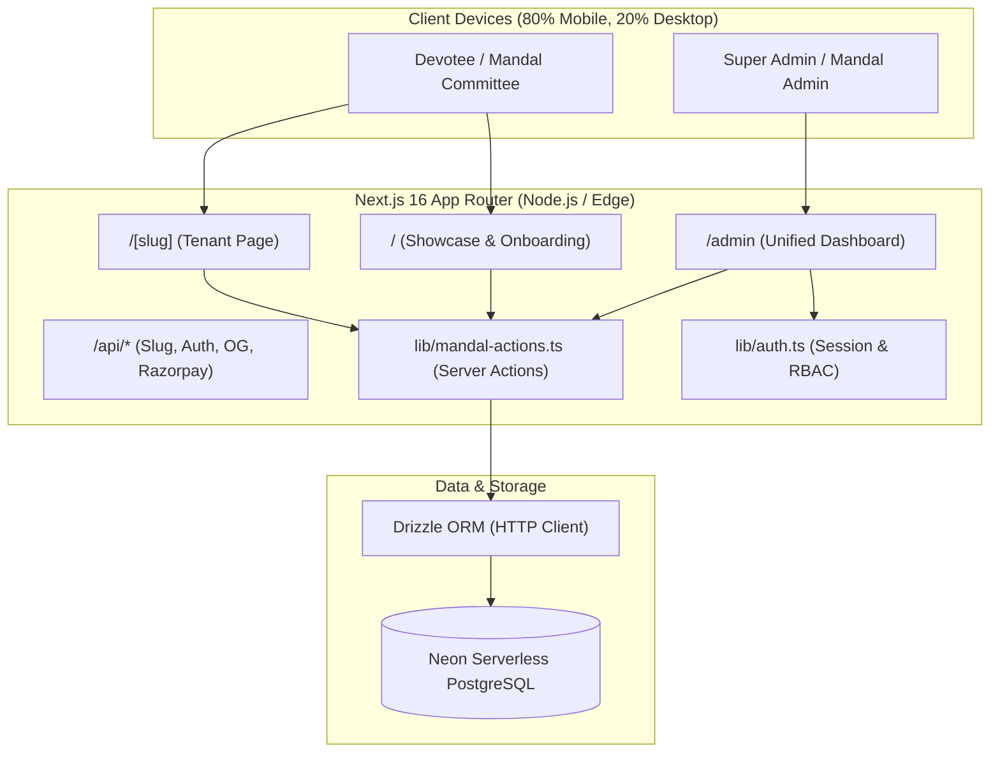

<div align="center">

# 🚩 Ganapati Invitation Platform
### Adviks SoftTech Digital Temple & Online Donation SaaS Platform

[](https://nextjs.org/)
[](https://react.dev/)
[](https://tailwindcss.com/)
[](https://orm.drizzle.team/)
[](https://neon.tech/)
[](https://www.typescriptlang.org/)
[](https://ganapati-invitation-platform.vercel.app)

<br/>

**A Mobile-First, Multi-Tenant Digital Temple Experience developed by Adviks SoftTech.**  
Enables Ganesh Mandals, Housing Societies, and Temple Trusts to create animated invitation websites, accept direct UPI/QR donations, schedule 10-day aarti programs, showcase festival galleries, and manage public onboarding through an enterprise administration portal.

[Explore Live Demos](#live-demo-showcase--4-spiritual-themes) • [Technical Architecture](docs/WORKFLOWS.md) • [Database Reference](docs/DATABASE.md) • [REST APIs](docs/API.md)

---

</div>

## Table of Contents

- [Platform Overview](#platform-overview)
- [Key Features](#key-features)
- [Live Demo Showcase & 4 Spiritual Themes](#live-demo-showcase--4-spiritual-themes)
- [Screenshots & UI Previews](#screenshots--ui-previews)
- [Technology Stack](#technology-stack)
- [System Architecture](#system-architecture)
- [Folder Structure](#folder-structure)
- [Getting Started](#getting-started)
  - [Prerequisites](#prerequisites)
  - [Installation](#installation)
  - [Environment Variables](#environment-variables)
  - [Database Setup & Migrations](#database-setup--migrations)
  - [Seeding Demo Data](#seeding-demo-data)
  - [Running Development Server](#running-development-server)
- [Authentication & Roles](#authentication--roles)
- [End-to-End Workflow](#end-to-end-workflow)
- [Modular Technical Documentation](#modular-technical-documentation)
- [Performance & Mobile Optimization](#performance--mobile-optimization)
- [Security & Data Protection](#security--data-protection)
- [Available npm Scripts](#available-npm-scripts)
- [Roadmap](#roadmap)
- [Contributing](#contributing)
- [License & Branding](#license--branding)

---

## Platform Overview

Traditional festival invitations rely on static paper cards or forwarded text messages that get buried in chat threads.

**Adviks SoftTech Ganapati Invitation Platform** modernizes festival communication into an interactive **digital temple experience**. Devotees enjoy interactive bronze bell chimes, ambient background video streams, devotional aartis, digital coconut-breaking rituals, community flower showers, embedded Google Maps navigation, and instant UPI/QR donation collections with automated WhatsApp verification proofs.

The platform employs a scalable **multi-tenant architecture**: a single Next.js deployment manages hundreds of independent mandal websites via dynamic URL paths (`/[slug]`), customizable themes, and isolated role-based admin accounts.

---

## Key Features

### 🌟 Public Devotee Experience
- **100vh Immersive Hero Banner**: Full-bleed background video stream, floating 3D-styled Ganapati murti, pulsating divine halos, and animated diya flames.
- **Interactive Cultural Rituals**:
  - **Temple Bell Chimes**: Tap or click bronze bells for physics-based swing animations and authentic chime sounds.
  - **Coconut Breaking (शुभ आरंभ)**: Interactive digital coconut break triggering community flower showers.
  - **Live Flower Shower Counter**: Real-time devotee flower offering counter stored in PostgreSQL.
- **10-Day Festival Timeline**: Detailed schedule covering daily morning/evening aarti timings, Satyanarayan pooja, mahaprasad, cultural events, and visarjan processions.
- **Interactive Media Lightbox**: High-resolution festival photo gallery and embedded video documentaries.
- **Executive Committee Directory**: Executive profiles with photos, designations, contact numbers, and social links.
- **Google Maps Integration**: One-click Google Maps navigation directions to the mandal pandal.
- **Personalized WhatsApp Invites**: Devotees can generate customized invitation messages addressed to their friends and family.
- **Dynamic Social Previews (`/api/og`)**: Automatic 1200x630px social card generation with Devanagari typography for WhatsApp link unfurling.

### 💰 Direct Donations & Financial Integrity
- **UPI & Dynamic QR Widget**: Displays official mandal UPI IDs (`upi://pay`) and custom QR codes.
- **Preset & Custom Amounts**: Instant selectors (₹101, ₹251, ₹501, ₹1001, ₹2100) or custom rupee inputs.
- **UTR & Screenshot Proof**: Devotees submit their 12-digit bank UTR reference and optional payment screenshot.
- **Instant WhatsApp Dispatch**: Formats and triggers pre-filled Devanagari WhatsApp notifications directly to the Mandal Treasurer.
- **Treasurer Verification Panel**: Audit panel with CSV exports and approval toggles (`pending` -> `verified` / `rejected`).

### 🛡️ Enterprise Moderation & Administration
- **Public Onboarding Form (`/submit`)**: 7-step wizard allowing committees to submit details, upload photos, and choose themes without prior account creation.
- **Super Admin Moderation Portal (`/admin`)**: Moderate submissions, preview unapproved layouts, assign custom slugs, and approve or reject applications.
- **Automated Credential Vault**: Super Admin dashboard automatically generates and stores temporary passwords for mandal administrators.
- **Full Version History & Instant Rollback**: Atomic point-in-time JSON snapshots preserve mandal states, allowing instant restoration if accidental changes occur.
- **Database Health Inspector (`/admin/database`)**: Real-time Neon connection diagnostics, ping latency measurement, and table statistics.

---

## Live Demo Showcase & 4 Spiritual Themes

The platform includes **4 distinct, interchangeable spiritual themes**, rendered dynamically via `components/themes/ThemeRenderer.tsx` without changing underlying data:

| Theme | Live Demo URL | Visual Inspiration | Palette |
| :--- | :--- | :--- | :--- |
| **Theme 1: Royal Gold** | [`/shri-jay-malhar-ganesh-mandal`](https://ganapati-invitation-platform.vercel.app/shri-jay-malhar-ganesh-mandal) | Suvarna Mandir, brass columns & royal palace gates | Gold (`#e8a93b`) & Deep Maroon (`#1c0609`) |
| **Theme 2: Peshwai** | [`/shri-swami-samarth-mitra-mandal`](https://ganapati-invitation-platform.vercel.app/shri-swami-samarth-mitra-mandal) | 18th-century Maratha Peshwa Wada & tutari motifs | Crimson (`#d96a2b`) & Burgundy (`#2c0507`) |
| **Theme 3: Divine Saffron** | [`/shri-shivneri-ganesh-mandal`](https://ganapati-invitation-platform.vercel.app/shri-shivneri-ganesh-mandal) | Modern glassmorphism & glowing Bhagwa aura | Saffron (`#ea580c`) & Dark Terracotta (`#180a03`) |
| **Theme 4: Night Darshan** | [`/shri-sant-dnyaneshwar-ganesh-mandal`](https://ganapati-invitation-platform.vercel.app/shri-sant-dnyaneshwar-ganesh-mandal) | Midnight illumination, glowing diyas & night sky | Neon Gold (`#38bdf8`) & Midnight Slate (`#050b14`) |

For design tokens, CSS variables, and adding a 5th theme, see [docs/THEMES.md](docs/THEMES.md).

---

## Screenshots & UI Previews

```text
+-----------------------------------------------------------------------+
|  [|| Shree Ganeshay Namah ||]            Adviks SoftTech Platform     |
|                                                                       |
|             ( ( ( Temple Bell Swing ) ) )                             |
|                                                                       |
|                         * * *                                         |
|                       *       *                                       |
|                      *  MURTI  *  <- Floating 3D Murti + Aura         |
|                       *       *                                       |
|                         * * *                                         |
|                                                                       |
|          श्री जय मल्हार गणेश मंडळ — रौप्य महोत्सवी गणेशोत्सव           |
|                                                                       |
|    [ 🌺 माझी वेबसाइट तयार करा ]        [ 👑 Super Admin Login ]       |
+-----------------------------------------------------------------------+
|  10-Day Timeline  |  Photo Gallery  |  Online Donation  | Google Map  |
+-----------------------------------------------------------------------+
```

---

## Technology Stack

- **Framework**: [Next.js 16.3.1](https://nextjs.org/) (App Router, Server Actions, Dynamic Routes)
- **UI Library**: [React 19.2.8](https://react.dev/)
- **Styling**: [Tailwind CSS 4](https://tailwindcss.com/) with PostCSS 8
- **Typography**: [Rozha One](https://fonts.google.com/specimen/Rozha+One) (Display) & [Mukta](https://fonts.google.com/specimen/Mukta) (Body) Devanagari Fonts
- **Database**: [Neon Serverless PostgreSQL](https://neon.tech/) with Connection Pooler
- **ORM**: [Drizzle ORM 0.45.2](https://orm.drizzle.team/) & [Drizzle Kit 0.31.10](https://orm.drizzle.team/kit-docs/overview)
- **Animations**: [Framer Motion 13.1](https://www.framer.com/motion/), [GSAP 3.15](https://gsap.com/), [@gsap/react](https://gsap.com/react/)
- **Image Compression**: [browser-image-compression 2.0.2](https://www.npmjs.com/package/browser-image-compression)
- **Payments**: [Razorpay 2.9.8](https://razorpay.com/) (HMAC SHA-256 signature verification)
- **Analytics**: [@vercel/analytics 2.0.1](https://vercel.com/analytics)
- **Runtime**: Node.js 20 LTS, TypeScript 5.x

---

## System Architecture



For full sequence diagrams and detailed pipelines, see [PROJECT_ARCHITECTURE.md](PROJECT_ARCHITECTURE.md) and [docs/WORKFLOWS.md](docs/WORKFLOWS.md).

---

## Folder Structure

```text
ganapati-invitation-platform/
├── app/
│   ├── [slug]/page.tsx              # Tenant mandal invitation page
│   ├── admin/                       # Dashboard, login, DB diagnostics & previews
│   ├── api/                         # Check-slug, login, og, update & razorpay routes
│   ├── demo/page.tsx                # Theme showcase comparison page
│   ├── edit/[token]/page.tsx        # Token-based secure editing page
│   ├── submit/                      # Public mandal application & thank-you pages
│   ├── track-order/page.tsx         # Application status lookup
│   ├── layout.tsx                   # Devanagari fonts & root layout
│   └── page.tsx                     # Main SaaS marketing landing page
├── components/
│   ├── admin/                       # Admin sidebar, editor, credentials & history panels
│   ├── common/                      # Background video, dividers, theme decorations
│   ├── themes/                      # Theme 1, 2, 3, 4 & ThemeRenderer
│   ├── DonationWidget.tsx           # Public UPI/QR donation widget
│   ├── FestiveAudioAndBlessing.tsx  # Audio player, temple bells & flower counter
│   ├── Hero.tsx                     # 100vh hero banner with floating murti
│   ├── SubmitForm.tsx               # 7-step tenant registration form
│   └── Timeline.tsx                 # 10-day festival program list
├── db/
│   ├── index.ts                     # Neon HTTP serverless connection
│   ├── schema.ts                    # 10 relational tables schema
│   └── seed.ts                      # Demo mandals & accounts seeder
├── docs/                            # Modular technical architecture manuals
├── lib/
│   ├── admin-actions.ts             # Super admin tenant operations
│   ├── auth.ts                      # Session encryption & RBAC security guards
│   ├── mandal-actions.ts            # Core database server actions
│   ├── photo-upload.ts              # Client-side image compression
│   ├── razorpay.ts                  # Razorpay SDK integration
│   └── slug.ts                      # Marathi slug converter
├── public/                          # Media assets (audio, videos, transparent murtis)
├── drizzle.config.ts                # Drizzle Kit CLI configuration
├── next.config.ts                   # Next.js 16 configuration
└── package.json                     # Project manifest & scripts
```

---

## Getting Started

### Prerequisites
- **Node.js**: v20.x LTS or higher
- **Package Manager**: `npm` (v9+) or `pnpm`
- **Database**: A PostgreSQL database instance ([Neon Serverless](https://neon.tech/) recommended)

### Installation
```bash
git clone https://github.com/dipak-pawar-356/ganapati-invitation-platform.git
cd ganapati-invitation-platform
npm install
```

### Environment Variables
Create `.env.local` in the project root:
```env
# Database Connection (Neon Serverless PostgreSQL)
DATABASE_URL="postgresql://<user>:<password>@<endpoint>-pooler.region.aws.neon.tech/ganapati-mandal-invitations?sslmode=require"
NEON_DATABASE_URL="postgresql://<user>:<password>@<endpoint>-pooler.region.aws.neon.tech/ganapati-mandal-invitations?sslmode=require"

# Platform Super Admin Authentication
PLATFORM_ADMIN_EMAIL="advikssoftware@ganpatiplatform.com"
PLATFORM_ADMIN_PASSWORD="YourSecurePasswordHere"
ADMIN_PASSWORD="YourSecurePasswordHere"

# Domain & Site Configuration
NEXT_PUBLIC_SITE_URL="http://localhost:3000"

# Optional: Razorpay Payment Gateway
RAZORPAY_KEY_ID="rzp_test_xxxxxxxxxxxx"
RAZORPAY_KEY_SECRET="your_razorpay_secret"
NEXT_PUBLIC_RAZORPAY_KEY_ID="rzp_test_xxxxxxxxxxxx"
RAZORPAY_WEBHOOK_SECRET="your_webhook_secret"
```

### Database Setup & Migrations
Synchronize the Drizzle schema directly with your Neon database:
```bash
npm run db:push
```

### Seeding Demo Data
Populate the database with the Super Admin account and the 4 demonstration mandals:
```bash
npm run db:seed
```

### Running Development Server
```bash
npm run dev
```
Open [http://localhost:3000](http://localhost:3000) in your browser.

---

## Authentication & Roles

| Role | Scope & Permissions | Access Guard |
| :--- | :--- | :--- |
| **`PLATFORM_ADMIN`** | Full platform control: Moderates and approves new mandals, assigns custom slugs, accesses credentials vault, rolls back version snapshots, and inspects database health. | `requirePlatformAdmin()` |
| **`MANDAL_ADMIN`** | Tenant control: Modifies content exclusively for their assigned mandal, manages 10-day timeline events, uploads photos, and verifies incoming devotee donations. | `requireMandalAdmin(mandalId)` |

For full cryptographic and session details, see [docs/AUTHENTICATION.md](docs/AUTHENTICATION.md).

---

## End-to-End Workflow

```text
Customer (Mandal Committee)
            │
            ▼
Submits Request at /submit (Status: PENDING)
            │
            ▼
Super Admin Moderation in /admin -> Submissions
            │
      ┌─────┴────────────────┐
      ▼                      ▼
  [ Reject ]           [ Approve Mandal ]
                         │
                         ├── Assigns custom permanent slug
                         ├── Auto-generates random 10-char password
                         ├── Inserts MANDAL_ADMIN user & credentials record
                         └── Revalidates Next.js edge cache
                                 │
                                 ▼
                    Website Live at /[slug]!
                                 │
                                 ▼
            Mandal Admin logs in to edit & verify donations
```

---

## Modular Technical Documentation

For deep technical dives into specific sub-systems, consult the dedicated guides in `/docs/`:

- [**`docs/DATABASE.md`**](docs/DATABASE.md): Detailed 10-table schema, indexes, foreign keys, and Drizzle types.
- [**`docs/API.md`**](docs/API.md): Complete REST endpoint reference with schemas and error codes.
- [**`docs/AUTHENTICATION.md`**](docs/AUTHENTICATION.md): Session cookie encryption, bcrypt hashing, and RBAC matrix.
- [**`docs/THEMES.md`**](docs/THEMES.md): Design tokens, cultural palettes, and adding a 5th theme tutorial.
- [**`docs/WORKFLOWS.md`**](docs/WORKFLOWS.md): Full Mermaid sequence diagrams for submissions, donations, and rollbacks.
- [**`docs/SECURITY.md`**](docs/SECURITY.md): XSS/CSRF defenses, HMAC verification, and moderation shielding.
- [**`docs/DEPLOYMENT.md`**](docs/DEPLOYMENT.md): Step-by-step Vercel and Neon production deployment manual.

---

## Performance & Mobile Optimization

- **Mobile First (80% Focus)**: Every component is optimized for 360px–420px viewports before desktop expansion.
- **Client-Side Image Compression**: `lib/photo-upload.ts` compresses user photos under 500KB and scales down to max 1200px before transmission using Web Workers.
- **Devanagari Font Preloading**: Native fonts `Rozha_One` and `Mukta` are preloaded via `next/font/google` with zero layout shifts (CLS = 0).
- **Reduced Motion Support**: GSAP and Framer Motion animations automatically respect `prefers-reduced-motion`.

---

## Security & Data Protection

- **Cascade Deletions**: Removing a tenant cleanly purges related timeline events, media, and credentials without orphan rows.
- **HTTP-Only Cookies**: Session tokens cannot be accessed via JavaScript (`document.cookie`).
- **Cryptographic Signatures**: Razorpay payments are validated using HMAC SHA-256 digests.
- **Tenant Shielding**: Mandals with `status = 'pending'` are strictly blocked from public rendering.

---

## Available npm Scripts

```bash
npm run dev       # Start Next.js local development server (localhost:3000)
npm run build     # Compile production build
npm run start     # Run production server
npm run lint      # Execute ESLint checks
npm run db:push   # Synchronize Drizzle schema with Neon PostgreSQL
npm run db:seed   # Seed Super Admin and 4 demonstration mandals
```

---

## Roadmap

- [ ] Web Push Notifications for live Aarti streaming alerts.
- [ ] Automated PDF donation receipt generation via headless browser.
- [ ] Multi-lingual interface toggles (Marathi, Hindi, English).
- [ ] Automated SMS notification gateway integration.

---

## Contributing

1. Fork the repository.
2. Create your branch: `git checkout -b feature/amazing-feature`
3. Commit your changes: `git commit -m 'feat: add amazing feature'`
4. Push to branch: `git push origin feature/amazing-feature`
5. Open a Pull Request.

---

## License & Branding

- **Platform Owner**: **Adviks SoftTech**
- **Lead Developer**: **Dipak Pawar**
- **License**: Commercial / Proprietary SaaS Platform. All rights reserved.
- **Support & Contact**: `advikssoftware@ganpatiplatform.com` • `+91 8669233747`