# Database Reference & Schema Documentation

This document provides complete technical specifications for the PostgreSQL database powering the **Adviks SoftTech Ganapati Mandal SaaS Platform**. The platform runs on **Neon Serverless PostgreSQL** and is queried via **Drizzle ORM** (`drizzle-orm/neon-http`).

---

## 1. Architectural Overview

- **Engine**: PostgreSQL 16+ (Serverless with connection pooling via Neon)
- **ORM Driver**: `drizzle-orm/neon-http` with `@neondatabase/serverless`
- **Migration Strategy**: Direct schema synchronization via `drizzle-kit push`
- **Referential Integrity**: All child entity relationships use `onDelete: "cascade"` to ensure that removing a tenant cleanly purges all related sub-items.
- **Connection Strings**:
  - `DATABASE_URL`: Primary pooled connection string (`?sslmode=require&channel_binding=require`)
  - `NEON_DATABASE_URL`: Fallback connection string for Neon HTTP driver

---

## 2. Entity Relationship Diagram (ERD)

```mermaid
erDiagram
    mandals ||--o{ users : "admin user accounts"
    mandals ||--o{ mandal_credentials : "auto-generated credentials"
    mandals ||--o{ version_history : "audit snapshots"
    mandals ||--o{ payments : "platform fee transactions"
    mandals ||--o{ timeline_events : "10-day schedule items"
    mandals ||--o{ gallery_items : "photos and videos"
    mandals ||--o{ committee_members : "trustees and volunteers"
    mandals ||--o{ murti_photos : "murti photos"
    mandals ||--o{ donation_transactions : "devotee online donations"

    mandals {
        uuid id PK
        text slug UK "Unique tenant URL identifier"
        text ref_number "e.g. REF-20260907-XXXX"
        text mandal_name "Formal Mandal Name"
        text mandal_type "Public Mandal | Society | Home"
        text subtitle "Short tagline or location line"
        text established_year "Year of establishment e.g. १९९८"
        text language "mr (Marathi) | en | hi"
        text invite_message "Devotee invitation text"
        text theme_id "royal_gold | peshwai | divine_saffron | night_darshan"
        text status "pending | approved | rejected | need_changes | published | suspended"
        text payment_status "pending | paid"
        integer amount "Platform setup fee (default 499)"
        text hero_video_url "Background/Hero video MP4 URL"
        text hero_bg_url "Hero poster backdrop image URL"
        text music_url "Devotional background audio MP3 URL"
        text contact_person_name "Lead representative name"
        text contact "Primary phone number"
        text mobile_number "Alternate contact"
        text whatsapp_number "WhatsApp communication number"
        text email "Contact email address"
        text address "Full physical mandal location"
        text city "City e.g. Pune, Satara, Mumbai"
        text district "District"
        text state "State e.g. Maharashtra"
        text pincode "Postal code"
        text map_embed_url "Google Maps iframe embed URL"
        text maps_link "Google Maps navigation link"
        text instagram_url "Official Instagram profile"
        text facebook_url "Official Facebook page"
        text youtube_url "YouTube video/channel URL"
        text website_url "Custom external domain"
        text logo_url "Mandal official logo"
        text ganpati_murti_url "Featured Murti image URL"
        text pdf_card_image_url "Custom printable card image"
        text daily_aarti_time "Daily aarti timings"
        text upi_id "Official UPI VPA for donations"
        text account_holder "Official beneficiary name"
        text qr_code_url "Custom payment QR code image"
        text support_mobile "Helpline number"
        text donation_message "Appeals text for donations"
        text donation_amount_options "e.g. 101,251,501,1001,2100"
        text about_mandal "Detailed mandal history & social work"
        text history "Detailed historical archive"
        text footer_text "Custom footer copyright/message"
        text team_photo_url "General executive committee group photo"
        text committee_name "Committee header title"
        text committee_description "Committee introduction"
        text president_group_photo_url "Trustees group photo"
        text committee_group_photo_url "Core committee photo"
        text volunteer_group_photo_url "Youth/Volunteers group photo"
        text team_caption "Photo caption"
        text team_description "Group description"
        integer show_team_section "1 = visible, 0 = hidden"
        text rejection_reason "Feedback if rejected/changes requested"
        text meta_title "Custom SEO title"
        text meta_description "Custom SEO description"
        text edit_token "Secure UUID token for passwordless edits"
        integer flower_count "Live community flower offering count"
        timestamptz created_at "Creation timestamp"
    }

    users {
        uuid id PK
        text email UK "Login email / username"
        text password_hash "bcrypt hashed password"
        text role "PLATFORM_ADMIN | MANDAL_ADMIN"
        uuid mandal_id FK "References mandals.id"
        timestamptz created_at "Registration timestamp"
    }

    mandal_credentials {
        uuid id PK
        uuid mandal_id FK "References mandals.id"
        text username "Super admin auto-generated username"
        text temp_password "Plaintext temp password for distribution"
        text status "active | deactivated"
        timestamptz created_at "Generation timestamp"
    }

    version_history {
        uuid id PK
        uuid mandal_id FK "References mandals.id"
        integer version_number "Incremental version number"
        text edited_by "SUPER_ADMIN | MANDAL_ADMIN | SUBMISSION_FORM"
        text change_summary "Summary of modifications"
        text snapshot_data "Full JSON snapshot of mandal & child rows"
        timestamptz created_at "Snapshot timestamp"
    }

    payments {
        uuid id PK
        uuid mandal_id FK "References mandals.id"
        text customer_name "Payer full name"
        text email "Payer email address"
        text phone "Payer mobile number"
        integer amount "Platform fee in INR"
        text payment_gateway "Razorpay | UPI_QR"
        text transaction_id "Gateway order / payment ID"
        text payment_status "pending | verified | failed"
        timestamptz created_at "Payment initiation timestamp"
    }

    timeline_events {
        uuid id PK
        uuid mandal_id FK "References mandals.id"
        text day "e.g. दिवस १, दिवस ५, दररोज"
        text title "Event title e.g. प्राणप्रतिष्ठापना"
        text subtitle "Event subtitle"
        text event_date "Date string e.g. ७ सप्टें"
        text event_time "Time e.g. सकाळी ९:०० वा."
        text description "Detailed program schedule"
        text image_url "Optional event photo"
        text bg_color "Custom card background color"
        integer display_order "Ordering sequence integer"
        timestamptz created_at "Creation timestamp"
    }

    gallery_items {
        uuid id PK
        uuid mandal_id FK "References mandals.id"
        text media_type "image | video"
        text url "Media URL (Data URL, Supabase, or external)"
        text caption "Media caption"
        integer display_order "Ordering sequence integer"
        timestamptz created_at "Upload timestamp"
    }

    committee_members {
        uuid id PK
        uuid mandal_id FK "References mandals.id"
        text name "Member full name"
        text position "e.g. अध्यक्ष, सचिव, खजिनदार"
        text photo_url "Member headshot photo URL"
        text phone "Contact phone number"
        text instagram_url "Instagram profile URL"
        text facebook_url "Facebook profile URL"
        integer is_displayed "1 = show on public card, 0 = hide"
        integer display_order "Ordering sequence integer"
        timestamptz created_at "Creation timestamp"
    }

    murti_photos {
        uuid id PK
        uuid mandal_id FK "References mandals.id"
        text photo_url "Murti photo URL"
        text caption "Darshan photo caption"
        integer display_order "Ordering sequence integer"
        timestamptz created_at "Creation timestamp"
    }

    donation_transactions {
        uuid id PK
        uuid mandal_id FK "References mandals.id"
        text donor_name "Devotee full name"
        text donor_whatsapp "Devotee WhatsApp mobile"
        integer amount "Donation amount in INR"
        text utr_number "12-digit bank transaction reference"
        text screenshot_url "Payment screenshot proof"
        text status "pending | verified | rejected"
        timestamptz created_at "Submission timestamp"
    }
```



---

## 3. Database Tables Deep-Dive

### 3.1 `mandals` Table
The primary tenant record containing all branding, configuration, themes, and contact details for a Ganesh Mandal.
- **Indexes**:
  - `mandals_slug_idx` on `slug` (Unique lookup index)
  - `mandals_status_idx` on `status` (Admin dashboard filter index)
  - `mandals_ref_number_idx` on `ref_number` (Track order lookup index)
- **Status Lifecycle**:
  - `pending`: Application submitted via `/submit`; shielded from public routing.
  - `approved`: Moderated and published by Super Admin with permanent slug.
  - `published`: Alias for approved and live.
  - `need_changes`: Super Admin requested edits; feedback recorded in `rejection_reason`.
  - `rejected`: Application denied.
  - `suspended`: Temporarily disabled by Super Admin; public route displays a suspension notice.

### 3.2 `users` Table
Handles role-based authentication credentials for Super Admins and Mandal Admins.
- **Indexes**:
  - `users_email_idx` on `email` (Unique login lookup)
  - `users_mandal_id_idx` on `mandal_id` (Tenant linkage)
- **Password Encryption**: Stored as bcrypt hashes with 10 salt rounds (`lib/auth.ts`).

### 3.3 `mandal_credentials` Table
Maintains a vault of generated temporary credentials for each approved mandal, viewable only by `PLATFORM_ADMIN` in the Super Admin dashboard for distribution over WhatsApp or SMS.
- **Indexes**:
  - `mandal_cred_mandal_idx` on `mandal_id`
  - `mandal_cred_username_idx` on `username`

### 3.4 `version_history` Table
Stores full-state JSON snapshots for point-in-time rollbacks.
- **Snapshot Payload**:
  ```json
  {
    "mandal": { ...mandalRow },
    "events": [ ...timelineRows ],
    "gallery": [ ...galleryRows ],
    "committee": [ ...committeeRows ]
  }
  ```
- **Indexes**: `version_history_mandal_idx` on `mandal_id`

### 3.5 `donation_transactions` Table
Stores incoming devotee donation submissions initiated through the `DonationWidget.tsx`.
- **Default Status**: `pending` until verified by Mandal Admin.
- **Indexes**:
  - `donation_trans_mandal_idx` on `mandal_id`
  - `donation_trans_status_idx` on `status`

---

## 4. Drizzle ORM TypeScript Types

```typescript
import { mandals, users, mandalCredentials, versionHistory, payments, timelineEvents, galleryItems, committeeMembers, murtiPhotos, donationTransactions } from "@/db/schema";

export type Mandal = typeof mandals.$inferSelect;
export type NewMandal = typeof mandals.$inferInsert;

export type User = typeof users.$inferSelect;
export type NewUser = typeof users.$inferInsert;

export type MandalCredential = typeof mandalCredentials.$inferSelect;
export type NewMandalCredential = typeof mandalCredentials.$inferInsert;

export type VersionHistoryRecord = typeof versionHistory.$inferSelect;
export type NewVersionHistoryRecord = typeof versionHistory.$inferInsert;

export type Payment = typeof payments.$inferSelect;
export type NewPayment = typeof payments.$inferInsert;

export type TimelineEvent = typeof timelineEvents.$inferSelect;
export type GalleryItem = typeof galleryItems.$inferSelect;
export type CommitteeMember = typeof committeeMembers.$inferSelect;
export type MurtiPhoto = typeof murtiPhotos.$inferSelect;

export type DonationTransaction = typeof donationTransactions.$inferSelect;
export type NewDonationTransaction = typeof donationTransactions.$inferInsert;
```

---

## 5. Migration & Maintenance Commands

```bash
# Push schema updates directly to Neon PostgreSQL
npm run db:push

# Run seed script (creates initial super admin & 4 demo mandals)
npm run db:seed
```
