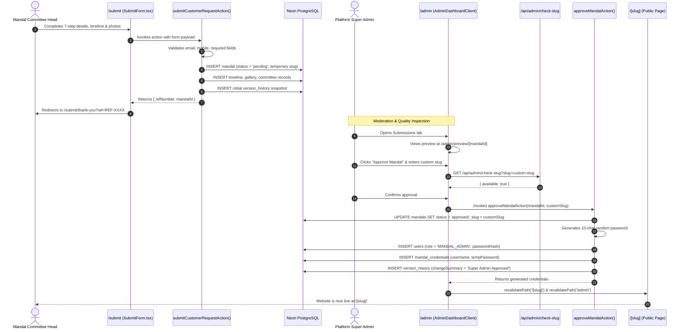
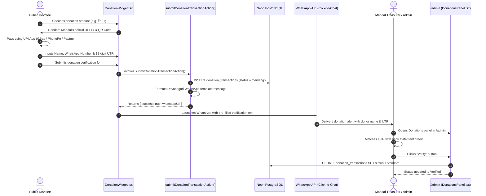
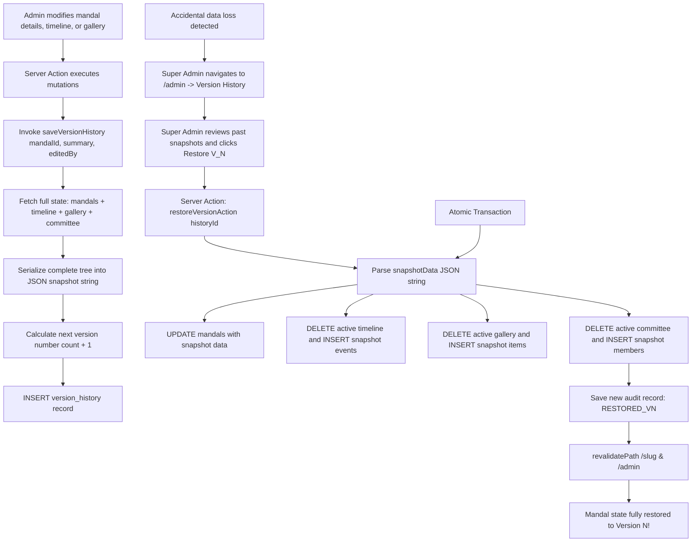

# System Workflows & Execution Pipelines

This document provides visual flowcharts and Mermaid sequence diagrams for all core business and operational workflows in the **Adviks SoftTech Ganapati Mandal SaaS Platform**.

---

## 1. Customer Onboarding & Super Admin Approval Workflow

A multi-step pipeline ensuring quality control before any mandal website is published to the public internet.



---

## 2. Devotee Donation & WhatsApp Verification Workflow

Provides a direct donation route via official UPI VPAs and QR codes, with automated WhatsApp proof routing to the Mandal Treasurer.



---

## 3. Version History & Snapshot Rollback Workflow

Guarantees full point-in-time state recovery in case of accidental content deletion by Mandal Admins.



---

## 4. Client-Side Image Compression & Upload Workflow

Protects server bandwidth and mobile payload limits using in-browser Web Worker compression.

```mermaid
flowchart LR
    File[Devotee / Committee File Input] --> CheckType{Is Image MIME?}
    CheckType -->|No| Reader[Read as raw Data URL]
    CheckType -->|Yes| Worker[Web Worker: browser-image-compression]
    Worker --> Compress[Max Size: 500KB | Max Width/Height: 1200px]
    Compress --> DataURL[FileReader.readAsDataURL]
    Reader --> DataURL
    DataURL --> ActionPayload[Safe Base64 String sent to Server Action]
    ActionPayload --> DB[Stored in PostgreSQL / External Storage]
```
